# Flask Stock Risk System 📈

A stock risk analysis system built with the Flask framework and backed by a SQL Server database. It supports user authentication, stock management, risk assessment, simulation analysis, and admin operations.

## 🔧 Tech Stack

- Python 3.7
- Flask
- SQL Server (via `pymssql`)
- HTML / CSS / Bootstrap
- Jinja2 (templating)

## 📁 Project Structure

SQL_Project/

│

├── static/ # Static assets (CSS, JS, images)

├── templates/ # HTML templates

│ ├── login.html

│ ├── home.html

│ ├── admin_home.html

│ └── ...

├── Project_Run.py # Main application entry

├── requirements.txt # Python dependencies

├── README.md # Project documentation

└── LICENSE

## 🚀 Features

- User registration and login (admin/user roles)
- Add and view stock data
- Analyze individual stock risk and simulate portfolio cost
- Risk evaluation and simulation tools
- Admin dashboard for user and data management

## 🛠️ Installation & Setup

1.Clone the repository
git clone https://github.com/hanhu561/Flask-Stock-Risk-System.git
cd Flask-Stock-Risk-System

2.Create and activate virtual environment
python -m venv venv
venv\Scripts\activate  # On Windows

3.Install dependencies
pip install -r requirements.txt

4.Configure the SQL Server database
Make sure SQL Server is running locally. Update the credentials in Project_Run.py:
conn = pymssql.connect(host='localhost', user='sa', password='your_password', database='Project')

5.Run the application
python Project_Run.py
Visit http://127.0.0.1:5000 in your browser.

✅ Modules Implemented
User login and permission control
Stock management and analysis
Cost simulation and portfolio tracking
Admin management interface
Database import via .sql script

📦 Database Info
SQL file: your_sql_file.sql (included in the root folder)
Contains table structure and sample data

🔐 Access Control
Admin: Can manage users, simulate analytics, and access all data
User: Can add/view their own stock data and run personal analysis

📌 Notes
Make sure pymssql is installed. If installation fails, consider using precompiled wheel from Gohlke
Ensure TCP/IP is enabled in your SQL Server configuration

📄 License
This project is licensed under the MIT License. See the LICENSE file for details.
Feel free to ⭐ star or fork this repository. If you have any suggestions or issues, open an issue or contribute directly!

## 🖼 UI show

### Initial Interface Display

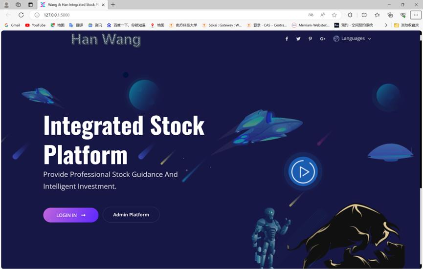

"LOGIN IN" means to log in at the client end. Admin Platform is for the administrator end to log in.

### Login Interface Display

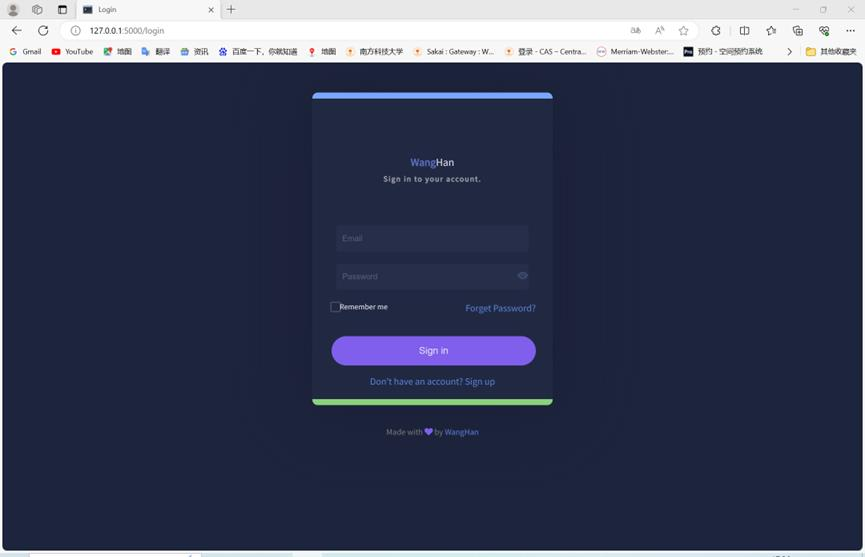

Query whether it is stored in the Account table. If there is a line in the input email and password, it will jump to the next one.  
On the interface, if the account is entered incorrectly and cannot be logged in, that is, the line where the email and password do not exist will pop up the following window.

### The Password or Account is Incorrect

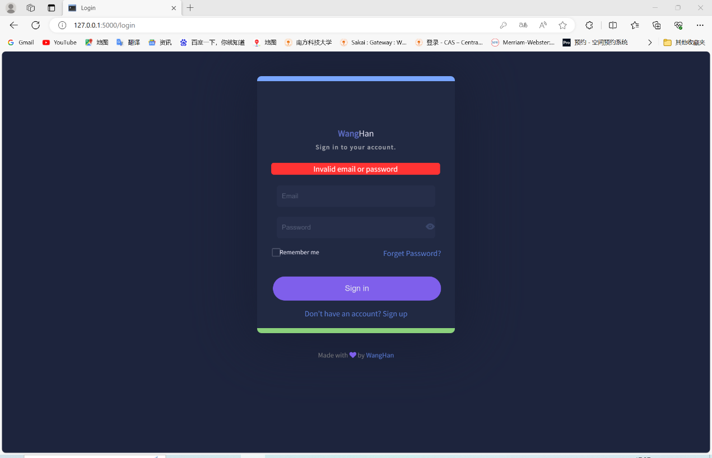

Similarly, the Administrator account uses the SQL statement to query Administrator.  
Check whether there are email and password rows in the table to verify the user account information.

### Account Interface

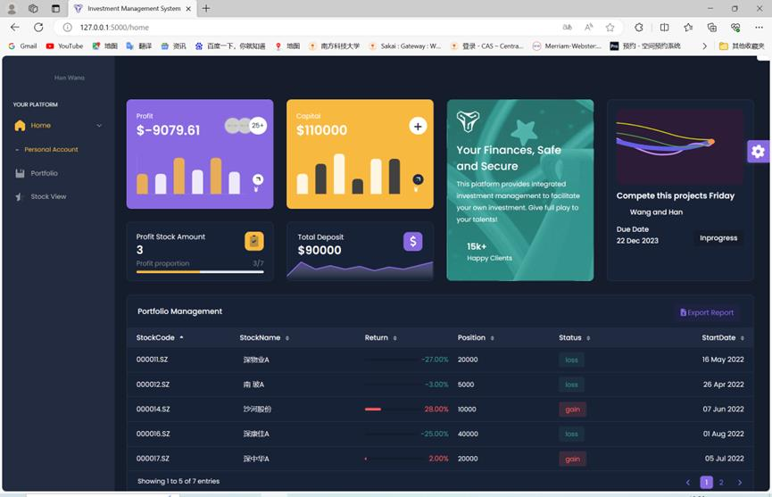

If the user enters the correct account on the login interface, it will be redirected to the user's initial interface.  
The system queries the Account table using the user's email and password to retrieve personal financial data, including Profit, Capital, Deposit, ProfitAmount (number of profitable investments), TotalAmount (total number of investments), and calculates P/T (profit-to-total ratio). This information is displayed at the top of the webpage via HTML.  
It also queries the Portfolio table for the user's investment data, including StockCode, StockName, Return (investment return rate), Position (shares held), and StartDate (start date of the investment). Based on Return, it determines the investment status: gain, loss, or even.  
The investment details are shown in the lower section of the HTML page, and can be sorted by StockCode, StockName, Return, Position, Status, and StartDate. Additionally, users can click the Export Report button to export portfolio data.

### Specific Information of Personal Accounts

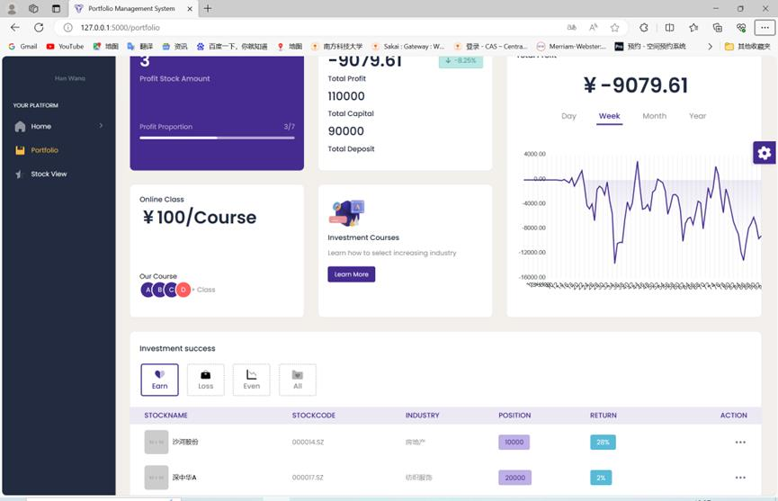

Clicking the Portfolio button on the left side of the HTML page navigates to the user's detailed account information. The system queries the Account table using the login email and password to retrieve data such as Profit, Capital, Deposit, ProfitAmount, TotalAmount, and calculates P/T (profit-to-total ratio), which is displayed in the upper section of the page.  
The lower section contains four buttons — Earn, Loss, Even, and All — to filter and display stocks based on performance.  
A custom function SimulateProfit(portfolio, Kinds) is used to calculate the user's daily, weekly, monthly, and yearly average returns. These results are shown in the top-right corner of the page and can be toggled using the Day, Week, Month, and Year buttons.

### Stock Modification and Deletion Functions

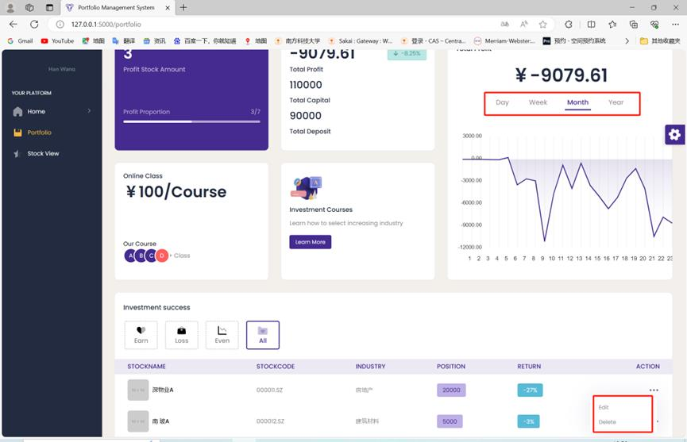

In the lower section of the HTML page, users can view stock information and perform edit or delete operations.  
Clicking Delete removes the selected stock from the portfolio.  
Clicking Edit redirects the user to the stock editing page, where the stock details can be modified.

### Interface for Stock Editing and Modification

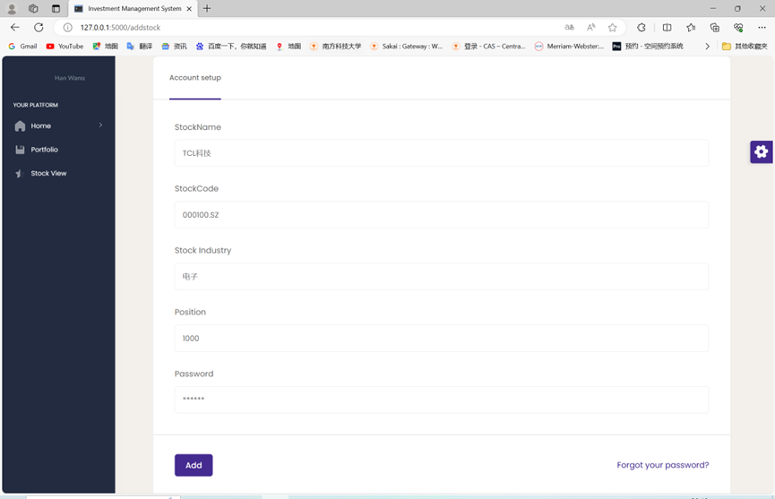

On the stock editing page, users can modify the Position (number of shares held). To ensure the operation is authorized, the system verifies the user's account by checking the password.  
Once verified, users can update the stock position and investment start date, allowing real-time adjustments to the portfolio on the same day.

### Stock Browsing Interface

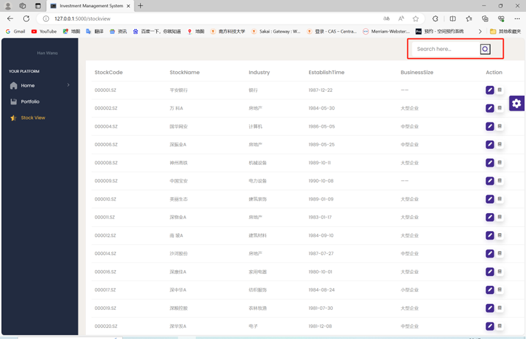

Clicking the StockView button on the left navigates to the stock browsing page.  
The system retrieves all stock data from the ManyStocks table using SQL queries and displays it via HTML.  
Each stock's StockCode, StockName, Industry, EstablishTime (establishment date), BusinessSize (company type), and StaffNum (number of employees) is shown.  
The search box in the top-right corner allows users to search for stocks.  
Using SQL queries, the system retrieves stocks related to the entered keyword.  
For example, entering "TCL" and clicking Search will display a list of stocks related to TCL.

### Add Stock Investment

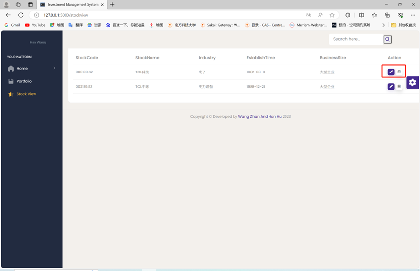

Each stock entry has two buttons on the right for viewing and adding investments.  
Clicking the left button navigates to the stock investment page, where users can add the stock to their portfolio.  
Clicking the right button navigates to the detailed view page for the selected stock.

### Stock Investment Page

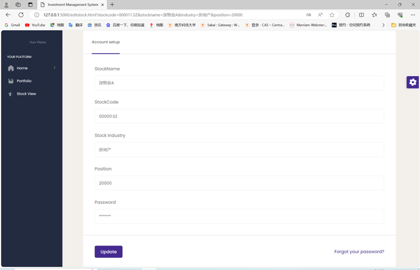

By entering the investment position and user password, the selected stock can be added to the user's portfolio.  
After verifying the password, the system inserts the investment data into the Portfolio table.

### Detailed View Page

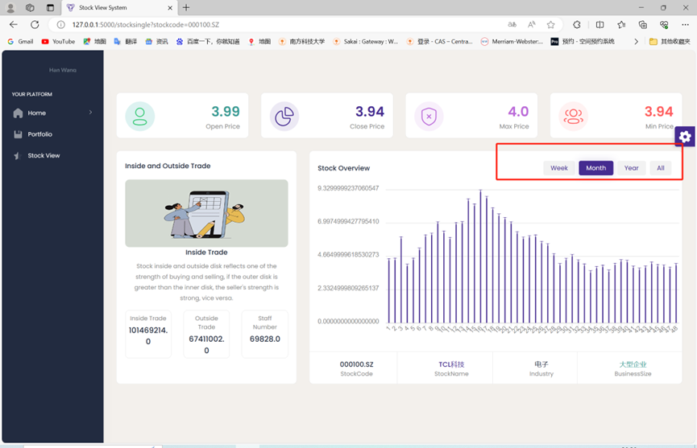

The individual stock detail page displays key information including:  
OpenPrice (opening price), ClosePrice (closing price), MaxPrice (highest price), MinPrice (lowest price), InsideTrade and OutsideTrade (trading volume data), as well as StaffNum (number of employees), StockName, Industry, and BusinessSize (company size).  
On the right side, the Week, Month, Year, and All buttons allow users to view the stock’s price changes on a weekly, monthly, yearly, or daily basis.

### Rights of Administrators

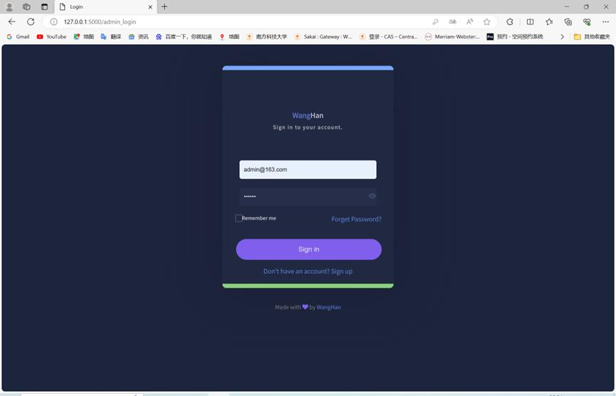

On the initial page, clicking Admin Platform allows the user to enter an admin account.  
If the account credentials are correct, the system redirects to the admin dashboard.

### Manage the User Interface

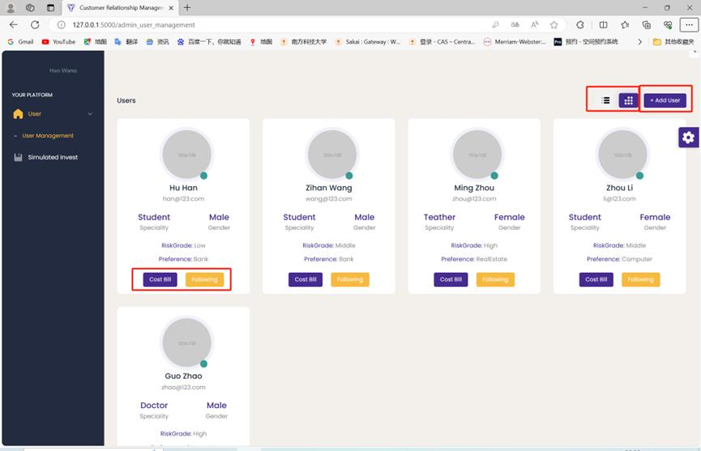

Clicking the Cost Bill button under the user section navigates to the user's CostBill page, where the user can view their transaction fee records.

### User's CostBill Page

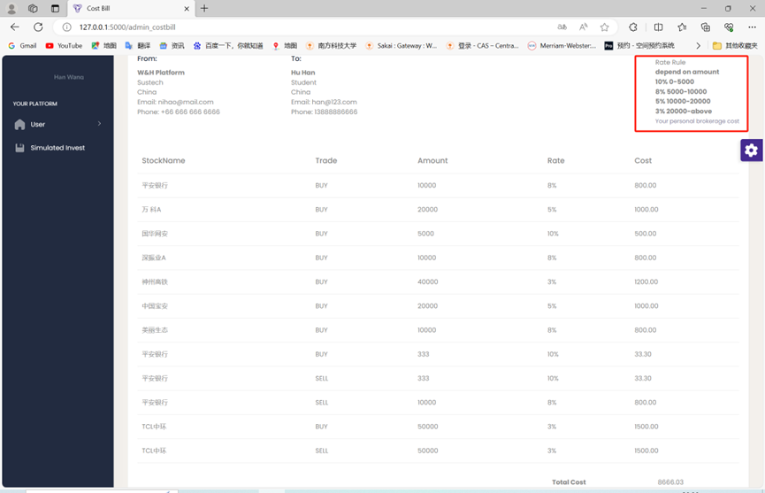

The system retrieves the user's personal information from the Individual table, including FirstName, LastName, Country, Phone, and total Cost, to generate the user's billing address and details.  
It also queries the BrokerageCost table and displays this information in the top-right section of the page, under From Platform to User (top-left of the page layout).  
Additionally, the system retrieves the user's trade history, including StockName, Trade type (BUY/SELL), and Quantity, and calculates the fee for each transaction based on the BrokerageCost table. These details are displayed on the page.

Clicking the Following button navigates to the user's personal investment page.

Here, the admin can view the user's portfolio, which is the same as the personal stock investment interface on the user side and will not be described again.

### Add User

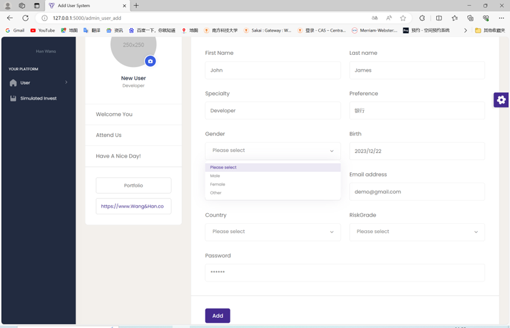

Clicking the Add User button in the top-right corner opens the user creation form.  
By filling in personal information and setting a password, a new user can be added.  
Fields such as Gender, Country, and RiskGrade are selected from dropdown options.  
Once completed, the user information is inserted into the database.

### List-Style-Type

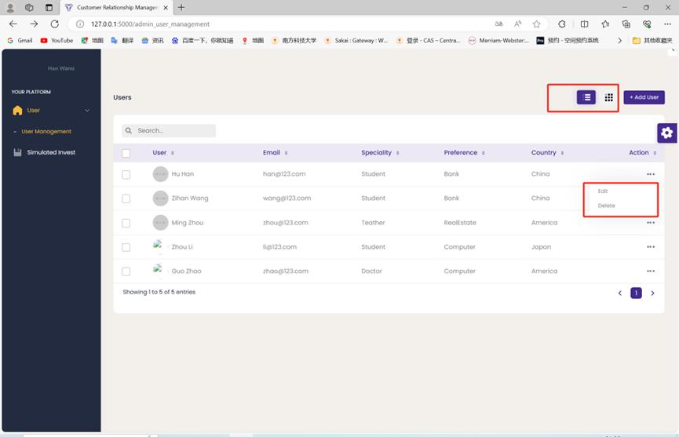

Clicking the button in the top-right corner switches the data display to a list view.  
The Search function in the top-left corner is implemented with HTML and also supports data queries.  
Clicking Edit redirects to the user information editing page, while clicking Delete removes the user information from the system.

### Edit User Information

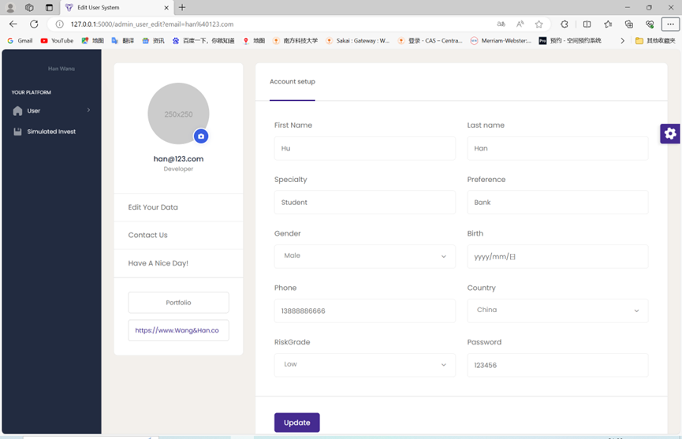

User information can be updated by filling out the edit form.  
The changes are applied to the database using SQL update statements.

### Simulated Stock Investment

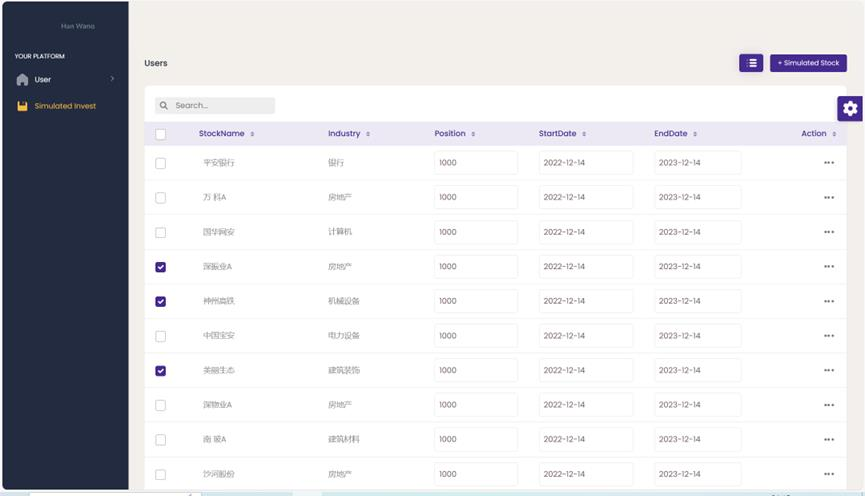

Clicking the Simulated Invest button on the right navigates to the stock simulation page, which supports stock searching.  
Users can select a stock, set the investment position and date, and then click the Simulated Stock button to perform a simulated investment.

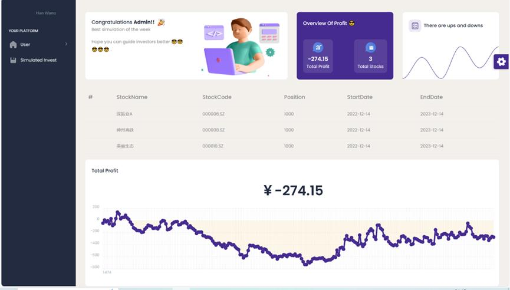

The system retrieves user input via request, and uses the SimulateProfit method (as previously described in the user section) to simulate the investment.  
SQL queries are used to assist in data retrieval, and the system then redirects to a new page displaying the simulation results.

